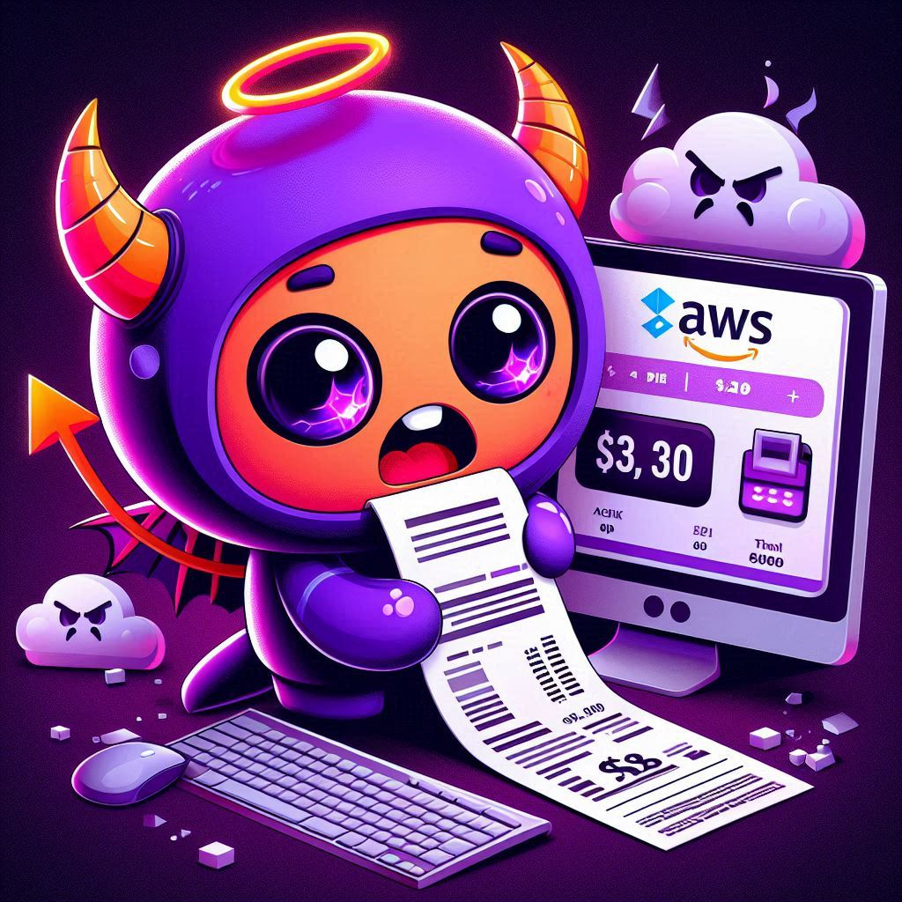

<div align="center"></div>

# Stop & Start EC2 Instances with AWS Lambda

This is a small project that covers 2 AWS Lambda functions, written in Python, designed to optimize AWS EC2 resource usage & cost by automatically managing instance uptime. 

The first Lambda function is scheduled to stop all running EC2 instances, ensuring that instances are not running during non-business hours, thus reducing unnecessary costs. The function will also tag the instances with `StopInstance::True`, so that it can be identified by the next function to start them again.

The second function can be triggered during the start of business hour and it will start the same instances with the tag `StopInstance::True`, ensuring availability for the workday. 

By utilizing these automated functions, the project aims to streamline operational efficiency while minimizing AWS costs through effective resource management.

### Prerequisites

- Basic knowledge on how to deploy a AWS Lambda, configure triggers and required permission
- Permissions to deploy AWS Lambda and add/remove/create IAM roles & permissions for AWS Lambda


### Usage
#### Stop Instance
1. Deploy the code on `StopInstances.py` on a freshly created Lambda.

2. Make sure the following permissions are included in the IAM Role, on top of the default permission required for the AWS Lambda to function:
    ```
    {
        "Version": "2012-10-17",
        "Statement": [
            {
                "Sid": "Statement1",
                "Effect": "Allow",
                "Action": [
                    "ec2:StopInstances",
                    "ec2:DescribeInstances",
                    "ec2:CreateTags"
                ],
                "Resource": "*"
            }
        ]
    }
    ```

3. Configure a trigger with EventBridge (CloudWatch Events), stating a schedule and the required schedule expression. For example, if I need the function to be triggered everyday at 1AM SGT, I will have the cron expression written as such:
    ```
    cron(0 17 * * ? *)
    ```
    Note: I have experience where I worked past 12AM, and this function got triggered, which jeopardized whatever that I was doing, multiple times! Having this triggered at 1AM seems to work better for me.

4. Optional - configure a destionation, which can be a Amazon SNS when it fails to run. This is not required, but it is good if you would like to know if the function fails to work.

#### Start Instance
1. Deploy the code on `StartInstances.py` on a fresly created Lambda.

2. Make sure the following permissions are included in the IAM Role, on top of the default permission required for the AWS Lambda to run:
    ```
    {
        "Version": "2012-10-17",
        "Statement": [
            {
                "Sid": "Statement1",
                "Effect": "Allow",
                "Action": [
                    "ec2:DescribeInstances",
                    "ec2:DeleteTags",
                    "ec2:StartInstances"
                ],
                "Resource": "*"
            }
        ]
    }
    ```


3. Configure a trigger with EventBridge (CloudWatch Events), stating a schedule and the required schedule expression. For example, if I need the function to be triggered every Monday to Friday at 9AM SGT, I will have the cron expression written as such:
    ```
    cron(0 1 ? * MON-FRI *)
    ```
    Note: You probably will ask why we have the Stop Instance function to be triggered daily, but Start Instance function to be triggered only from Monday to Friday. This is because we want you to stop working on weekends! But if you still proceed to do so, the Stop Instance will still have your instances stopped when you sleep! 

4. Optional - configure a destionation, which can be a Amazon SNS when it fails to run. This is not required for this to work, but it is good if you would like to know if the function fails to work.


#### Conclusion
This are just simple scripts that is designed to minimize your cost on your AWS account. Feel free to give me a ping for any bug or improvement required.